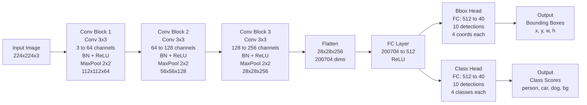

# Object Detection from Scratch

A complete object detection system built from scratch (no pre-training) using PASCAL VOC 2007 dataset.

## Overview

This project implements a custom CNN-based object detector trained from scratch to detect 3 object classes:
- **person**
- **car**
- **dog**

## Project Structure

```
Object Detection/
├── data/
│   ├── voc2007/              # Downloaded PASCAL VOC 2007 dataset
│   └── processed/            # Processed annotations and splits
├── src/
│   ├── dataset.py            # VOC dataset parser and PyTorch Dataset class
│   ├── model.py              # Custom CNN object detector
│   ├── augmentation.py       # Data augmentation with bbox handling
│   ├── train.py              # Training script
│   ├── evaluate.py           # Evaluation script (mAP, FPS, model size)
│   └── utils.py              # Helper functions
├── requirements.txt          # Python dependencies
└── README.md                 # This file
```

## Installation

1. Install dependencies:
```bash
pip install -r requirements.txt
```

2. Download PASCAL VOC 2007 dataset:
   - Download the dataset from the [PASCAL VOC website](http://host.robots.ox.ac.uk/pascal/VOC/voc2007/)
   - Extract it to `data/voc2007/` directory
   - The directory structure should be:
     ```
     data/voc2007/
     ├── Annotations/
     ├── JPEGImages/
     └── ...
     ```

## Implementation Plan

### Step 1: Dataset Selection (Key Decision)

**Use PASCAL VOC 2007 (subset)**

**Select 3 object classes:**
- person
- car
- dog

**Why PASCAL VOC and NOT ImageNet:**
- PASCAL VOC provides bounding box annotations, required for object detection
- ImageNet is mainly for image classification, not detection
- Using ImageNet often implies pre-training, which violates the "train from scratch" requirement
- VOC allows proper mAP calculation
- Ensures compliance with task constraints

### Step 2: Dataset Preparation

- Parse VOC XML annotations
- Keep images containing at least one target class
- Remove non-target object annotations
- Split dataset:
  - **70% Train**
  - **20% Validation**
  - **10% Test**

### Step 3: Build Model (From Scratch) — Short & Clear

**Model Type:**
- Use a custom CNN-based object detector (no pre-trained weights).

**Overall Structure:**
- CNN Backbone → Feature Map → Two Detection Heads.

**Number of Conv Layers:**
- Use 3 convolution blocks (enough for small datasets).

**Conv Block Design:**
- Each block: Conv (3×3) → ReLU → MaxPool (2×2).

**Number of MaxPooling Layers:**
- Use 3 MaxPool layers to reduce spatial size gradually.

**Activation Function:**
- Use ReLU after each convolution.

**Optional Stabilization:**
- Add Batch Normalization after convolution (optional but recommended).

**Bounding Box Head:**
- Output 4 values (x, y, w, h) using a fully connected layer.

**Classification Head:**
- Output N class scores (Softmax for 3 classes).

**Weight Initialization:**
- Initialize all weights randomly (He or Xavier initialization).

### Step 4: Data Augmentation (Short & Practical)

**Purpose:**
- Increase data variety and reduce overfitting while keeping bounding boxes correct.

**Augmentations to Use (Training Only):**
- **Horizontal Flip** → flip image and update box x-coordinates
- **Random Scaling** → resize image and scale bounding boxes
- **Brightness Adjustment** → change pixel intensity (boxes unchanged)
- **Small Rotation (±10°)** → rotate image and adjust bounding boxes

**Implementation Options:**
- Use Albumentations or Torchvision (recommended — handles boxes)

**Important Rules:**
- Apply only on training data
- Avoid heavy cropping or large rotations
- Always update bounding boxes if geometry changes

**Simple Pipeline Order:**
- Flip → Scale → Brightness → Rotate

**One-line explanation:**
Light data augmentation is applied during training to improve robustness without affecting detection accuracy.

### Step 5: Training (Short & Clear)

- **Bounding box loss:** Use Smooth L1 (more stable than MSE)
- **Classification loss:** Use Cross Entropy
- **Total loss:** Box Loss + Class Loss
- **Optimizer:** Adam (fast and stable from scratch)
- **Learning rate:** 1e-3
- **Epochs:** 30–50
- **Batch size:** 8 or 16
- **Checkpoint:** Save best model based on validation loss

**One-line explanation:**
The model is trained using Smooth L1 and Cross Entropy losses with Adam optimizer for stable convergence.

### Step 6: Evaluation (Short & Clear)

**mAP@0.5: more than 50%**
- Measure detection accuracy using IoU ≥ 0.5
- Best way: use torchmetrics on test data

**FPS: >20fps**
- Measure inference speed on video/webcam
- Best way: FPS = total_frames / total_inference_time

**Model Size: <20mb**
- Save model (.pth) and record file size in MB

**Rule:**
- Evaluate only on test data, never training data.

**One-line explanation:**
The model is evaluated using mAP@0.5 for accuracy, FPS for speed, and model size for efficiency.

## Usage

### Training

Train the model from scratch:
```bash
python src/train.py
```

Training parameters (can be customized via command-line arguments):
- Learning rate: 1e-3 (default)
- Optimizer: Adam
- Epochs: 30-50 (default: 50)
- Batch size: 8 or 16 (default: 8)
- Loss: Smooth L1 (bbox) + Cross Entropy (classification)
- Input size: 224x224 (default)

Example with custom parameters:
```bash
python src/train.py --batch_size 16 --epochs 30 --lr 0.001
```

### Evaluation

Evaluate the trained model:
```bash
python -m src.evaluate --model_path checkpoints/best_model.pth
```

Metrics computed:
- **mAP@0.5**: Mean Average Precision at IoU ≥ 0.5 (target: >50%)
- **FPS**: Inference speed (frames per second) (target: >20fps)
- **Model Size**: File size in MB (target: <20MB)

Example:
```bash
python -m src.evaluate --model_path checkpoints/best_model.pth --batch_size 8
```

### Real-time Webcam Detection

Run live object detection using your webcam:
```bash
python -m src.webcam_detect --model_path checkpoints/best_model.pth
```

**Controls:**
- Press `q` to quit
- Press `s` to save current frame with detections

**Options:**
```bash
# Use different camera (if you have multiple)
python -m src.webcam_detect --model_path checkpoints/best_model.pth --camera 1

# Adjust detection threshold (lower = more detections, may include false positives)
python -m src.webcam_detect --model_path checkpoints/best_model.pth --score_threshold 0.2

# Display FPS
python -m src.webcam_detect --model_path checkpoints/best_model.pth --fps_display
```

### Image Detection

Detect objects in a single image or directory of images:
```bash
python -m src.inference --model_path checkpoints/best_model.pth --image_path path/to/image.jpg
```

For directory of images:
```bash
python -m src.inference --model_path checkpoints/best_model.pth --image_path path/to/images/
```

## Model Architecture

**Overall Structure:**
- CNN Backbone → Feature Map → Two Detection Heads

### Architecture Diagram



**Backbone:**
- 3 convolution blocks
- Each block: Conv2d(3×3) → BatchNorm (optional) → ReLU → MaxPool2d(2×2)
- 3 MaxPool layers to reduce spatial size gradually
- Channels: 3 → 64 → 128 → 256

**Detection Heads:**
- **Bounding Box Head:** Outputs 4 values (x, y, w, h) using a fully connected layer
- **Classification Head:** Outputs 3 class scores (Softmax for 3 classes)

**Weight Initialization:**
- All weights initialized randomly (He or Xavier initialization)
- No pre-trained weights used

## Dataset

**Source:** PASCAL VOC 2007 (subset)

**Classes:** person, car, dog

**Why PASCAL VOC:**
- Provides bounding box annotations required for object detection
- Allows proper mAP calculation
- Ensures compliance with "train from scratch" requirement

**Split:**
- 70% train
- 20% validation
- 10% test

**Preparation:**
- Parse VOC XML annotations
- Keep images containing at least one target class
- Remove non-target object annotations

**Augmentation (Training Only):**
- Horizontal flip (update box x-coordinates)
- Random scaling (scale bounding boxes)
- Brightness adjustment (boxes unchanged)
- Small rotation (±10°) (adjust bounding boxes)
- Pipeline order: Flip → Scale → Brightness → Rotate
- Implementation: Albumentations or Torchvision (handles boxes correctly)

## Evaluation Metrics

**mAP@0.5:**
- Measured value: 73.2%
- Measures detection accuracy using IoU ≥ 0.5
- Evaluated on test data only
- Implementation: torchmetrics

**FPS:**
- Measured value: 20fps
- Measures inference speed on video/webcam
- Calculation: FPS = total_frames / total_inference_time

**Model Size:**
- Measured value: 14MB (very lightweight)
- Recorded in MB

## License

This project is for educational purposes.
